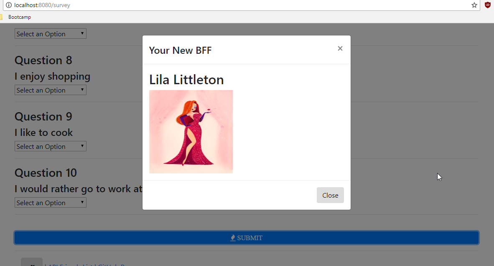

# friendfinder199
Node and Express Servers

Rhonda Johnson

## Overview

FriendFinder is an app which uses a series of survey questions to find the best compatible friend.  This ful-stack site takes in results from the users' surveys, then compares their answers with those from other users.  The app will then display the name and picture of the user with the best overall match. 

# Link to deployed project
https://friendfinder199.herokuapp.com/

# Links to GitHub
https://github.com/rmxjohnson/friendfinder199.git

https://rmxjohnson.github.io/friendfinder199/

# Built with:
 * Node.js
 * NPM packages:  express, body-parser, path
 * Express is used to handle the routing

## Synopsis 

# home.html

* Home page - button to redirect user to survey page

# survey.html

* Webpage to collect use input: name, picture, & 10 compatability questions [answers are on a scale of 1 (strong agree) to 5 (strongly disagree)]
* When the user submits their answers, a modal will display with the name and picture of their "best match"
* Validation of answers - page cannot be submitted until all fields have been completed

# server.js

* Requires basic npm packages: express, body-parser, path

# htmlRoutes.js

* GET route to '/survey' - to display survey page
* default catch-all route that leads to 'home/html' which displays the home page

# apiRoutes.js

* GET route with url '/api/firends - to display JSON of all possible friends
* POST routes '/api/friends'.  This handles the incoming survey results. Also handles the compatibility logic.

# friends.js

* An array of "friend" objects

# Compatiblity logic
* Each users' responses to the survey are saved as an array of numbers
* Compare the difference betwee the current user's scores against those from other users, question by question.  Add up the differences to calculate the 'totalDifference' (use absolute value of each question difference)
* The closes match will be the friend with the least amount of difference
* Once the most compatible friend is found, their name and picture is displayed in the modal pop-up

